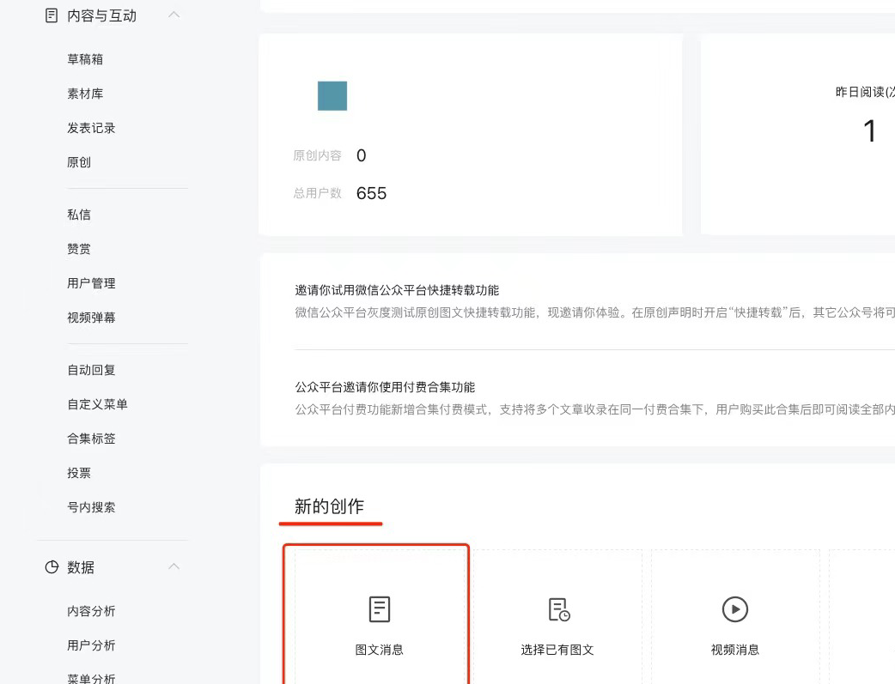

锁屏启动App是一款基于iOS16系统的快捷指令软件，可以通过简单设置一键打开健康码/核酸码/行程码/等日常经常需要用到的二维码，并且通过小组件形式可以使用户在锁屏状态下快速亮码。

但除此之外，还可以通过这样一款小巧的App实现一键打卡场所码的功能，避免每次进出常去场所时打卡的麻烦。

<!--more-->

# 项目目的

通过外部App唤起微信小程序，并实现一键自动打卡场所码的目的。

# 配置步骤

### 资料准备

1.拍下经常出入的场所的场所码作为备用，比如小区、公司写字楼、上下班需要进入的地铁站、经常去的商圈等

2.打开已经注册的公众号后台（公众号注册和绑定可以在网上看一下教程），并点击首页—新的创作—图文消息

3.在图文消息创作页面顶端，点击小程序

4.选择小程序页面内输入粤省事，点击进入下一步

5.在填写详细信息页面中，将鼠标光标置于小程序路径框下方的获取更多页面途径位置，并在右侧弹出框中输入需要进行场所码打卡的微信号后，点击开启按钮

6.打开微信扫一扫，扫描第一步中拍下的需要打卡的场所码，点击右上角三个点，在下方弹出框中点击复制页面路径

7.点击下方弹出框中粤省事，点击更多资料，复制账号原始ID

### 软件安装

在App Store中搜索锁屏启动App，下载安装

### 快捷指令设置

1.在App内锁屏页面，点击待设置项右侧三个点，点击弹出框中编辑

2.在编辑启动项页面中点击自定义，并将之前复制下来的小程序账号原始ID和场所码页面路径复制到下面对应位置中，将完整链接粘贴到URL Scheme框内，点击保存并测试运行，场所码即可一键自动打卡

`weixin://?userName=小程序账号原始ID&path=页面路路径`

3.重复上述操作，可以将常用的场所码都设置为桌面小组件，在需要时即可一键打卡，避免频繁的扫码和等待亮码