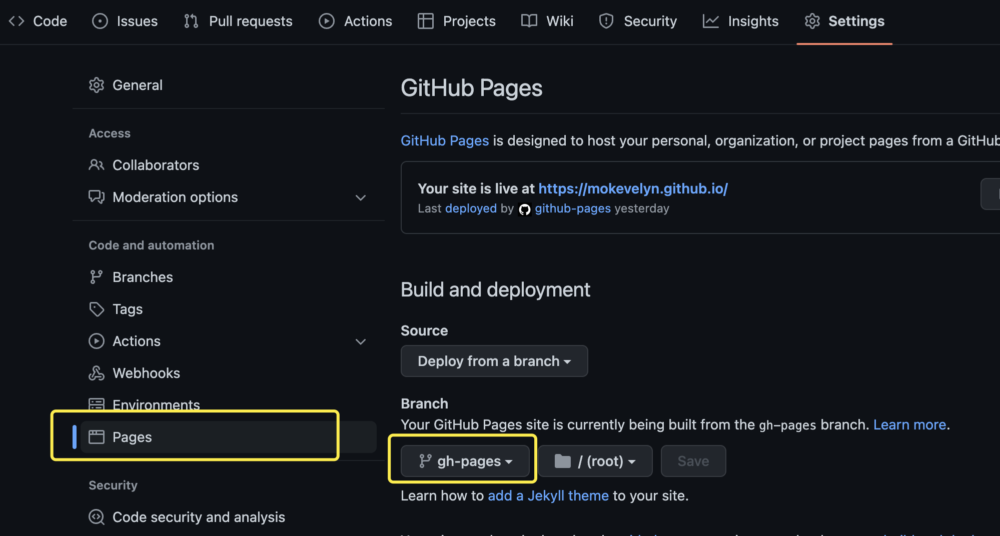

Github Actions是Github提供的持续集成服务，帮助自动化实现抓取代码、运行测试、登录远程服务器，发布到第三方服务等

<!--more-->


# 项目目的

利用GitHub Actions的持续集成服务，可以实现Hugo博客在Github Pages上的自动部署：自动生成静态文件，并将静态文件发布到Github Pages博客仓库里，从而避免了每次更新博文、图片时手动维护博客。


由于在网上没有找到完整可靠的全流程配置部署，所以自己写了一篇，希望能帮助到后来人。


# 配置步骤

#### 创建Github Pages仓库

1.新建Github仓库，仓库名命名为<username>.github.io，其中<username>与Github用户名需相同


2.将博客根目录文件夹初始化为一个Git仓库

```
git init
```


3.配置Git仓库

```
# 配置下当前仓库的 Git 用户信息
git config user.name "mokevelyn"
git config user.email "mokevelyn@gmail.com"
# user.name与 GitHub 上保持一致
# user.email必须与 GitHub 上的邮箱一致：
# https://github.com/settings/emails

# 添加 GitHub 上的远程仓库（需要先去 GitHub 上新建一个仓库）
# username处填入自己的Github用户名
git remote add origin git@github.com:username/username.github.io.git

# 添加所有改动
git add -A

# 提交改动
git commit -m "init"

# 首次上传到远程仓库
git push
```


4.在Github Pages仓库新建gh-pages分支

在下图搜索框中搜索gh-pages，并点击<font color=#2596be>`creat gh-pages from main`</font>，创建分支




#### workflow文件准备

1.打开本地博客根目录，在本地博客根目录下建立`.github/workflows`目录，并在该目录下创建一个yml文件，命名为`gh-pages.yml`

```
mkdir .github
mkdir .github/workflows
touch .github/workflows/gh-pages.yml
```


2.在gh-pages.yml文件内贴入以下内容

```
name: github pages

on:
  push:
    branches:
      - main  # Set a branch to deploy

jobs:
  deploy:
    runs-on: ubuntu-22.04
    steps:
      - uses: actions/checkout@v3
        with:
          submodules: true  # Fetch Hugo themes (true OR recursive)
          fetch-depth: 0    # Fetch all history for .GitInfo and .Lastmod

      - name: Setup Hugo
        uses: peaceiris/actions-hugo@v2
        with:
          hugo-version: 'latest'
          # extended: true

      - name: Build
        run: hugo --theme=hugo-clarity --baseUrl="https://<username>.github.io/"
        # theme=后填入你的Hugo博客使用的主题，baseUrl=""引号内填入你的博客网址，如果使用Github Pages博客仓库提供的网址，则在<username>内填入你的Github用户名

      - name: Deploy
        uses: peaceiris/actions-gh-pages@v3
        if: github.ref == 'refs/heads/main'
        with:
          deploy_key: ${{ secrets.DEPLOY_KEY }}  
          publish_dir: ./public  
```


3.设置SSH keys

```
cd ~/.ssh
```

如果~/.ssh文件夹不存在，则输入以下代码（将邮箱地址改为你Github上的邮箱）

```
mkdir -p ~/.ssh
cd ~/.ssh
ssh-keygen -t rsa -b 4096 -C "mokevelyn@gmail.com"
# 一路回车即可
```

查看生成的公钥并复制，在Github--Seetings--SSH and GPG keys设置中创建一个公钥并命名为id_rsa.pub

```
cat ~/.ssh/id_rsa.pub
```


4.设置deploy_key

生成一对新的公/私钥，并命名为deploy_key

```
# 修改 username 为你自己的 GitHub 用户名
ssh-keygen -t rsa -b 4096 -C "username@users.noreply.github.com"
# 注意：这次不要直接回车，以免覆盖之前生成的
```


然后，查看并将生成的公/私钥内容分别复制、添加：

```
cat ~/.ssh/deploy_key.pub
cat ~/.ssh/deploy_key
```

- 公钥（deploy_key.pub)

  前往 GitHub Pages 仓库，Settings > Deploy keys > Add deploy key

  <font color=#2596be>务必勾选 Allow write access</font>

- 私钥（deploy_key)

  前往 GitHub Pages 仓库，Settings > Secrets > New secret

  <font color=#2596be>Name 必须为 `DEPLOY_KEY`</font>

  

5.推送改动到Github

```
git add -A
git commit -m "refactor: use hugo-deploy action"
git push
```


在 GitHub 上，打开你的源码仓库页面，在 Actions 处查看日志。顺利的话，一分钟内就能完成构建和部署。

部署成功之后，前往 GitHub Pages 仓库，Settings > Pages，将 Source 中的 Branch 选择为 `gh-pages`（gh-page.yml文件中`DEPLOY_BRANCH` 的值）


最后，打开<font color =#2596be> ` https://<username>.github.io`</font>，应该就能看到博客成功上线。

今后，我们在本地写好文章预览后，只需将改动推送到 GitHub 源码仓库，GitHub Actions 就会自动构建并部署 `.public`，也即持续集成部署我们的博客。
