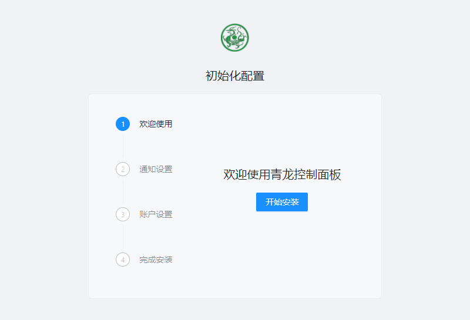
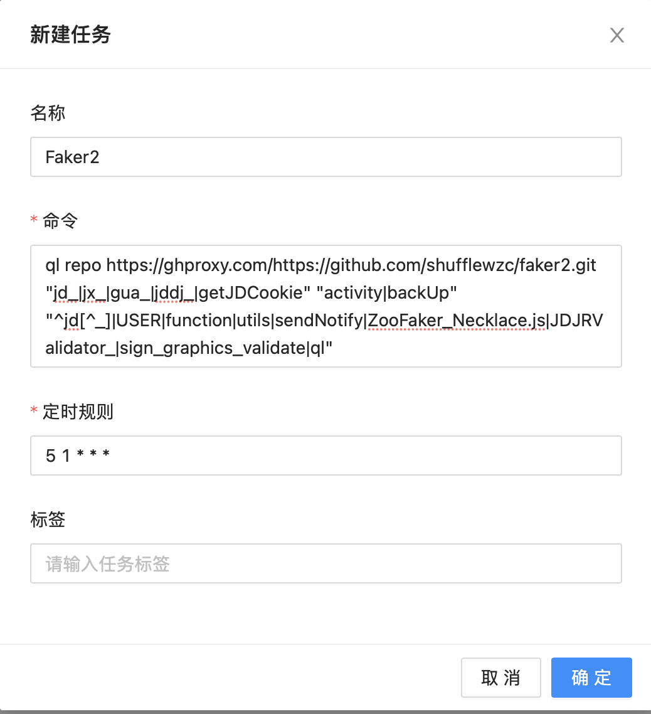
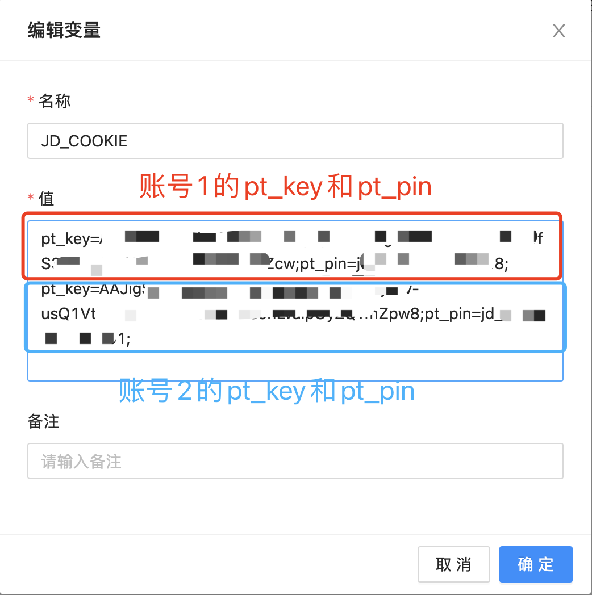

青龙面板是一个脚本的管理系统，能够自动、定时执行脚本，对于一些需要自动化、定时完成的工作，使用青龙面板可以极大提高效率、节省人力。


使用青龙面板挂京东活动，其实就是从开源的库中拉取并自动执行各种活动脚本，自动完成对应活动任务、领取京豆奖励。

<!--more-->


## 项目目的

使用青龙面板自动、定时执行脚本，获取京豆收益


## 配置步骤

### 下载、安装docker

1. 检查yum源并更新

   ```sudo yum check-update```

2. 下载docker

   ```	curl -fsSL https://get.docker.com/ | sh```

3. 启动docker

   ```	sudo systemctl start docker```

4. 查看docker状态

   ```sudo systemctl status -l docker.service```

5. 设置开机自启

   ```	sudo systemctl enable docker```


### 安装青龙面板

1. 官方下载、安装青龙面板

   由于总有人尝试通过默认端口登陆别人的青龙面板，因此建议更换端口，不要使用默认的5700端口，改为其他端口。

   （以下命令行操作需在**/root**目录下进行）

   ```
   docker run -dit \
     -v $PWD/ql:/ql/data \
     -p 任意端口:5700 \
     --name qinglong \
     --hostname qinglong \
     --restart unless-stopped \
     whyour/qinglong:latest
   ```

2. 开放防火墙的对应端口并重新载入

   ```
   firewall-cmd --zone=public --add-port=上一步你所输入的任意端口/tcp --permanent
   firewall-cmd --reload
   ```

3. 初始化青龙面板

​	部署完成后，直接访问`服务器IP:第一步时输入的任意端口`访问青龙面板的初始化界面

​	


​	通知方式可以暂时跳过，后期有需要再自行设置。

​	在账户设置中设置管理员账号密码，如果后期忘记了管理员账号密码可以在ssh中通过以下代码找回：

​	```docker exec -it qinglong cat /ql/config/auth.json```


### 拉取脚本库

以下仅列取近期仍在维护的库，如今后以下库不再维护，读者可去寻找其他还在维护的库并拉取脚本（不可同时拉取Faker2和Faker3的库）

Faker2:

```
ql repo https://ghproxy.com/https://github.com/shufflewzc/faker2.git "jd_|jx_|gua_|jddj_|getJDCookie" "activity|backUp" "^jd[^_]|USER|function|utils|sendNotify|ZooFaker_Necklace.js|JDJRValidator_|sign_graphics_validate|ql"
```

Kr:

```
ql repo https://github.com/KingRan/KR.git "jd_|jx_|jdCookie" "activity|backUp" "^jd[^_]|USER|utils|function|sign|sendNotify|ql|JDJR"
```

Faker3:

```
ql repo https://ghproxy.com/https://github.com/shufflewzc/faker3.git "jd_|jx_|gua_|jddj_|getJDCookie" "activity|backUp" "^jd[^_]|USER|function|utils|sendNotify|ZooFaker_Necklace.js|JDJRValidator_|sign_graphics_validate|ql"
```


复制以上任意一个库的拉库命令，然后打开青龙面板——新建任务，在命令中粘贴刚才复制的拉库命令，并填入定时规则，然后点击确定




添加任务后手动点击运行，运行完之后刷新一下页面，脚本就自动拉取到青龙面板中了


### 京东token获取

使用Alook手机浏览器登录京东，在工具箱——开发者工具——Cookies——拷贝，找到复制下来的cookies中的找的**pt_key**和**pt_pin**，粘贴到青龙面板的环境变量中。

如需添加多个账号的pt_key和pt_pin，每个账号的pt_key和pt_pin要另起一行，同一个账号的pt_key和pt_pin之间无需换行，只需要用`;`分开即可。





到这一步为止，所有脚本和环境变量就已经配置完成，如果需要接收通知，可以在青龙面板进行设置，这里推荐使用Server酱，具体的设置可以在Server酱官方文档内查看，操作非常简单。